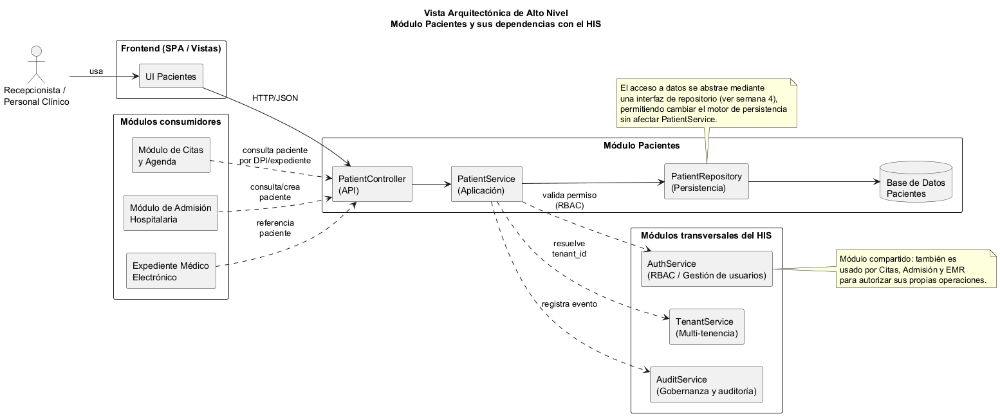

# Semana 3 — Diseño arquitectónico, vistas y patrones

**Estudiante:** Glendi Patricia Campos Orellana (`Glendi20`)
**Módulo:** Pacientes: registro, edición, búsqueda y detalle
**Rama sugerida:** `feature/week-03-arquitectura` (desde `developer`)

## 1. Vista arquitectónica de alto nivel

Fuente editable: [`vista-arquitectonica.puml`](vista-arquitectonica.puml).

## 2. Descripción de componentes propios del módulo

| Componente | Responsabilidad |
|---|---|
| **UI Pacientes** (frontend) | Presenta los formularios de registro/edición y los resultados de búsqueda/detalle al usuario. |
| **PatientController** (API) | Recibe las peticiones HTTP, valida el contrato de entrada y delega en `PatientService`. |
| **PatientService** (aplicación) | Orquesta el caso de uso: valida datos, verifica permisos vía `AuthService`, resuelve el tenant vía `TenantService`, persiste vía `PatientRepository` y notifica a `AuditService`. |
| **PatientRepository** (persistencia) | Abstrae el acceso a la base de datos de pacientes (ver patrón repositorio, semana 4). |

## 3. Dependencias con el resto del HIS

- **AuthService (RBAC):** el módulo de Pacientes **depende de** este servicio compartido para autorizar
  cualquier edición (RF-05 de la semana 2). No es exclusivo de Pacientes: también lo usan Citas, Admisión y
  el Expediente Médico.
- **TenantService:** todas las operaciones de Pacientes resuelven el `tenant_id` del usuario autenticado
  para garantizar el aislamiento multi-tenant (RNF-03).
- **AuditService:** cada alta, edición o intento denegado genera un evento de auditoría (RF-07 / RNF-06).
- **Módulos consumidores (dependencia inversa):** Citas, Admisión y el Expediente Médico **dependen de**
  Pacientes —no al revés— porque necesitan referenciar o consultar un paciente ya existente a través del
  contrato expuesto por `PatientController`. Esto confirma que Pacientes es un **dominio central (core
  domain)** del HIS: varios módulos lo consumen, pero el módulo de Pacientes no conoce ni depende de ellos.

## 4. Patrón arquitectónico aplicado

Se aplica una **arquitectura en capas** (presentación → API → aplicación → persistencia) combinada con el
**patrón repositorio** para desacoplar `PatientService` del motor de base de datos concreto. Esta decisión
es la misma que sustenta el ejemplo de SOLID (Dependency Inversion / Single Responsibility) de la semana 2 y
se formaliza con el diagrama de capas de la semana 4.

## 5. Trazabilidad con la actividad UML previa

Los nombres de componentes (`PatientController`, `PatientService`, `PatientRepository`, `AuthService`,
`AuditService`) son los mismos participantes usados en el diagrama de secuencia de la actividad UML
(`docs/diagramas/03_secuencia.puml`), manteniendo consistencia entre el análisis de casos de uso y el
diseño arquitectónico del módulo.
